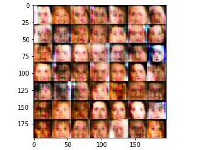
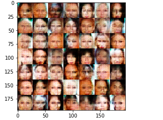
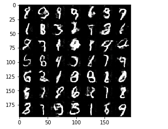
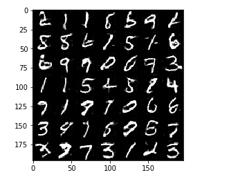

# Face Generation DCGAN

Using deep learning DCGAN neural network to generate realistic faces from celebrity images.

# Floydhub

### 1. Create a FloydHub account

* Install the floyd CLI on your local machine through these two [steps](https://www.floydhub.com/welcome):

```
$ pip install -U floyd-cli

$ floyd login
# Follow the instructions on your CLI
```

### 2. Clone this project to your local machine

```
$ cd /path/to/your-project-dir
$ floyd clone udacity/projects/face-generation/5
```

### 3. Create your project version on FloydHub
* [Create a project](https://www.floydhub.com/projects/create) on FloydHub and then sync the cloned repository with your new project
```
$ floyd init your-project-name
```

### 4. Run the project through a jupyter notebook

* The `--env` flag specifies the environment that this project should run on, which is a Tensorflow 1.2.0 + Keras 2.0.6 backend environment with Python 3.5.
* The `--data` flag specifies that the mnist dataset should be available at the `/mnist` directory and celeba dataset should be available at the `/celeba` directory
* The `--mode` flag specifies that this job should provide us a Jupyter notebook
* Note that the `--gpu` flag is optional for now, unless you want to start right away to run the code on a GPU machine. Since you'll be exploring and playing around with the code, you might not need a GPU instance right away, so you can avoid that flag now and restart it later with a GPU instance.

```
floyd run \
  --env tensorflow-1.2 \
  --data udacity/datasets/mnist/1:mnist \
  --data udacity/datasets/celeba/1:celeba \
  --mode jupyter \
  --gpu
```

Once the job is started, the jupyter notebook will open in your browser and you are ready to go!


# Overview

Using a Deep Convolutional Generative Adversarial Network (DCGAN) to generates new images of faces. The dataset that's used is the [CelebFaces Atrribute Dataset (CelebA)](http://mmlab.ie.cuhk.edu.hk/projects/CelebA.html), which contains over 200,000 celebrity faces with annotations.

Tensorflow implementation of [Deep Convolutional Generative Adversarial Networks](http://arxiv.org/abs/1511.06434) which is a stabilize Generative Adversarial Networks. 

### Files

[Jupyter Notebook](https://github.com/mnarasimhan02/DeepLearningND/tree/master/face_generation/face_generation.ipynb)

### Hyperparameters

Hyperparameter          | Number |
----------------------- | ------ |
Epochs                  | 1      |
Batch size              | 64     |
Learning rate           | 0.0001 |
Z dimension             | 100    |
Beta 1                  | 0.5    |

## Results

### celebA

After 10 iterations:



After 20 iterations:



### MNIST

After 10 iterations:



After 20 iterations:




## Related works

- [DCGAN-paper](https://arxiv.org/pdf/1511.06434.pdf)
